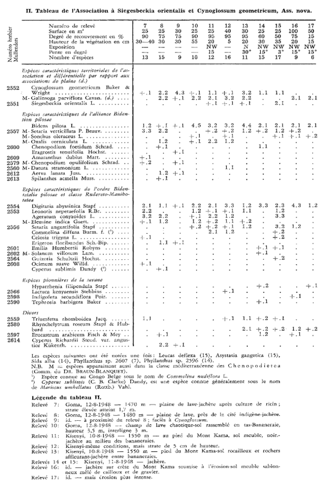
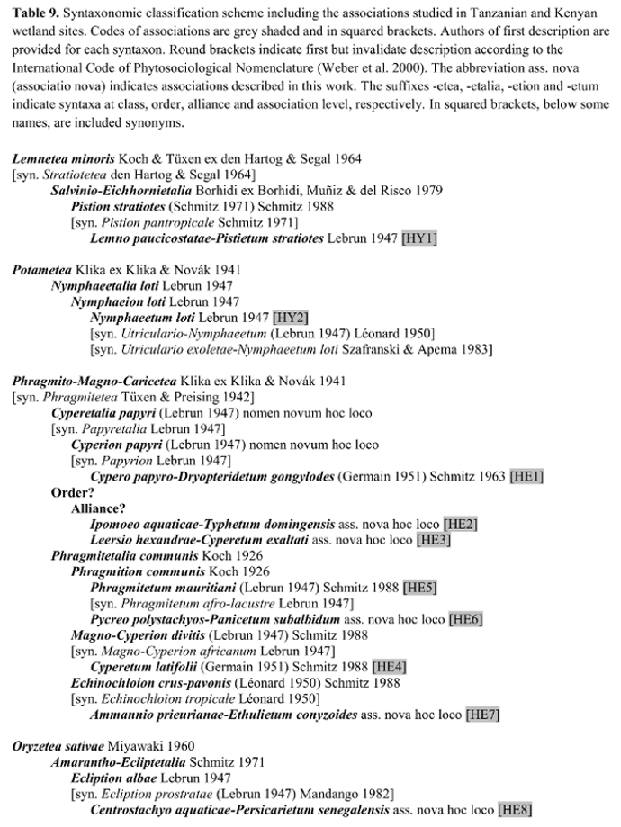

# Applying taxlist to species lists on diversity records

## 1. Getting started

The package `taxlist` aims to implement an object class and functions
(methods) for handling taxonomic data in **R**. The homonymous object
class `taxlist` can be further linked to biodiversity records (e.g. for
observations in vegetation plots).

The `taxlist` package is developed on the repository **GitHub**
(<https://github.com/ropensci/taxlist>) and can be installed in your
R-session using the package `devtools`:

``` r

library(devtools)
install_github("ropensci/taxlist", build_vignettes = TRUE)
```

Since this package is already available in the Comprehensive R Archive
Network (CRAN), it is also possible to install it using the function
`install.packages`:

``` r

install.packages("taxlist", dependencies = TRUE)
```

Of course, you have to load `taxlist` into your R-session.

``` r

library(taxlist)
```

For accessing to this vignette, use following command:

``` r

vignette("taxlist-intro")
```

## 2. Extracting a species list from a vegetation table

### 2.1 Example data

One of the main tasks of `taxlist` is to structure taxonomic information
for a further linkage to biodiversity records. This structure have to be
on the one side consistent with taxonomic issues (e.g. synonyms,
hierarchies, etc.), on the other side have to be flexible for containing
different depth of information availability (from plain species lists to
hierarchical structures).

In this guide, we will work with a species list from phytosociological
relevés collected at the borderline between the **Democratic Republic of
the Congo** and **Rwanda** (Mullenders 1953 *Vegetatio* 4(2): 73–83).



The digitized data can be loaded by following command:

``` r

load(file.path(path.package("taxlist"), "Cross.rda"))
```

The data is formatted as `data.frame` in **R**, including the names of
the species in the first column:

``` r

head(Cross[, 1:8])
```

    ##                 TaxonName 3094 3093 3092 3095 3096 3097 3098
    ## 1   Eragrostis tenuifolia    + <NA> <NA> <NA> <NA> <NA> <NA>
    ## 2        Cyperus sublimis <NA>    + <NA> <NA> <NA> <NA> <NA>
    ## 3    Digitaria abyssinica    +    1    2    2    2    3    1
    ## 4 Hyparrhenia filipendula <NA> <NA> <NA> <NA> <NA> <NA> <NA>
    ## 5    Erigeron floribundus    +    1 <NA> <NA> <NA> <NA> <NA>
    ## 6            Aerva lanata    +    1 <NA> <NA> <NA> <NA> <NA>

### 2.2 From plain list to taxlist

As already mentioned, the first column in the cross table contains the
names of the species occurring in the observed plots. Thus, we can use
this character vector to construct a `taxlist` object. This can be
achieved through the function
[`df2taxlist()`](https://docs.ropensci.org/taxlist/reference/df2taxlist.md).

``` r

sp_list <- Cross[, "TaxonName"]
sp_list <- df2taxlist(x = sp_list)
```

    ## Missing column 'TaxonConceptID' in 'x'. All names will be considered as accepted names.

``` r

summary(sp_list)
```

    ## object size: 9 Kb 
    ## validation of 'taxlist' object: TRUE 
    ## 
    ## number of taxon usage names: 35 
    ## number of taxon concepts: 35 
    ## trait entries: 0 
    ## number of trait variables: 0 
    ## taxon views: 0

Note that the function `summary` provides a quick overview in the
content of the resulting object. This function can be also applied to a
specific taxon:

``` r

summary(object = sp_list, ConceptID = "Erigeron floribundus")
```

    ## ------------------------------ 
    ## concept ID: 5 
    ## view ID: none 
    ## level: none 
    ## parent: none 
    ## 
    ## # accepted name: 
    ## 5 Erigeron floribundus NA 
    ## ------------------------------

## 3. Built-in data set

### 3.1 Easplist

The installation of `taxlist` includes the data `Easplist`, which is
formatted as a `taxlist` object. This data is a subset of the species
list used by the database **SWEA-Dataveg** ([GIVD ID
AF-006](http://www.givd.info/ID/AF-00-006 "SWEA-Dataveg")):

``` r

data(Easplist)
Easplist
```

    ## object size: 761.4 Kb 
    ## validation of 'taxlist' object: TRUE 
    ## 
    ## number of taxon usage names: 5393 
    ## number of taxon concepts: 3887 
    ## trait entries: 311 
    ## number of trait variables: 1 
    ## taxon views: 3 
    ## 
    ## concepts with parents: 3698 
    ## concepts with children: 1343 
    ## 
    ## concepts with rank information: 3887 
    ## concepts without rank information: 0 
    ## 
    ## family: 186
    ##   genus: 1011
    ##     complex: 1
    ##       species: 2521
    ##         subspecies: 71
    ##           variety: 95
    ##             form: 2

### 3.2 Access to slots

The common ways to access to the content of slots in `S4` objects are
either using the function `slot(object, name)` or the symbol `@`
(i.e. `object@name`). Additional functions, which are specific for
`taxlist` objects are `taxon_names`, `taxon_relations`, `taxon_traits`
and `taxon_views` (see the help documentation).

Additionally, it is possible to use the methods `$` and `[` , the first
for access to information in the slot `taxonTraits`, while the second
can be also used for other slots in the object.

``` r

summary(as.factor(Easplist$life_form))
```

    ##   acropleustophyte        chamaephyte     climbing_plant facultative_annual 
    ##                  8                 25                 25                 20 
    ##    obligate_annual       phanerophyte   pleustohelophyte         reed_plant 
    ##                114                 26                  8                 14 
    ##      reptant_plant      tussock_plant                NAs 
    ##                 19                 52               3576

### 3.3 Subsets

Methods for the function `subset` are also implemented in this package.
Such subsets usually apply pattern matching (for character vectors) or
logical operations and are analogous to query building in relational
databases. The `subset` method can be apply to any slot by setting the
value of the argument `slot`.

``` r

Papyrus <- subset(x = Easplist, subset = grepl("papyrus", TaxonName), slot = "names")
summary(Papyrus, "all")
```

Or the very same results:

``` r

Papyrus <- subset(x = Easplist, subset = TaxonConceptID == 206, slot = "relations")
summary(Papyrus, "all")
```

Similarly, you can look for a specific name.

``` r

Phraaus <- subset(
  x = Easplist,
  subset = charmatch("Phragmites australis", TaxonName), slot = "names"
)
summary(Phraaus, "all")
```

### 3.4 Hierarchical structure

Objects belonging to the class `taxlist` can optionally content
parent-child relationships and taxonomic levels. Such information is
also included in the data `Easplist`, as shown in the summary output.

``` r

Easplist
```

    ## object size: 761.4 Kb 
    ## validation of 'taxlist' object: TRUE 
    ## 
    ## number of taxon usage names: 5393 
    ## number of taxon concepts: 3887 
    ## trait entries: 311 
    ## number of trait variables: 1 
    ## taxon views: 3 
    ## 
    ## concepts with parents: 3698 
    ## concepts with children: 1343 
    ## 
    ## concepts with rank information: 3887 
    ## concepts without rank information: 0 
    ## 
    ## family: 186
    ##   genus: 1011
    ##     complex: 1
    ##       species: 2521
    ##         subspecies: 71
    ##           variety: 95
    ##             form: 2

Note that such information can get lost once
[`subset()`](https://docs.ropensci.org/taxlist/reference/subset.md) has
been applied, since the respective parents or children from the original
data set are not anymore in the subset. May you like to recover parents
and children, you can use the functions
[`get_parents()`](https://docs.ropensci.org/taxlist/reference/get_children.md)
or
[`get_children()`](https://docs.ropensci.org/taxlist/reference/get_children.md),
respectively.

``` r

summary(Papyrus, "all")
```

    ## ------------------------------ 
    ## concept ID: 206 
    ## view ID: 1 
    ## level: species 
    ## parent: none 
    ## 
    ## # accepted name: 
    ## 206 Cyperus papyrus L. 
    ## 
    ## # synonyms (2): 
    ## 52612 Cyperus papyrus ssp. antiquorum (Willd.) Chiov. 
    ## 52613 Cyperus papyrus ssp. nyassicus Chiov. 
    ## ------------------------------

``` r

Papyrus <- get_parents(Easplist, Papyrus)
summary(Papyrus, "all")
```

    ## ------------------------------ 
    ## concept ID: 206 
    ## view ID: 1 
    ## level: species 
    ## parent: 54853 Cyperus L. 
    ## 
    ## # accepted name: 
    ## 206 Cyperus papyrus L. 
    ## 
    ## # synonyms (2): 
    ## 52612 Cyperus papyrus ssp. antiquorum (Willd.) Chiov. 
    ## 52613 Cyperus papyrus ssp. nyassicus Chiov. 
    ## ------------------------------ 
    ## concept ID: 54853 
    ## view ID: 2 
    ## level: genus 
    ## parent: 55959 Cyperaceae Juss. 
    ## 
    ## # accepted name: 
    ## 54855 Cyperus L. 
    ## ------------------------------ 
    ## concept ID: 55959 
    ## view ID: 3 
    ## level: family 
    ## parent: none 
    ## 
    ## # accepted name: 
    ## 55961 Cyperaceae Juss. 
    ## ------------------------------

Another way to represent taxonomic ranks is by using the function
[`indented_list()`](https://docs.ropensci.org/taxlist/reference/indented_list.md).

``` r

indented_list(Papyrus)
```

    ## Cyperaceae Juss.
    ##  Cyperus L.
    ##    Cyperus papyrus L.

## 4. Applying taxlist to syntaxonomic schemes

### 4.1 Example of a phytosociological classification

To illustrate the flexibility of the `taxlist` objects, the next example
will handle a syntaxonomical scheme. As example it will be used a scheme
proposed by the author for aquatic and semi-aquatic vegetation in
Tanzania (Alvarez 2017 *Phytocoenologia* in review). The scheme includes
10 associations classified into 4 classes:



### 4.2 Building the taxlist object

The content for the taxonomic list is included in a data frame and can
be downloaded by following command:

``` r

load(file.path(path.package("taxlist"), "wetlands_syntax.rda"))
```

The data frame `Concepts` contains the list of syntaxon names that are
considered as accepted in the previous scheme. This list will be used to
insert the new concepts in the `taxlist` object.

``` r

head(Concepts)
```

    ##   TaxonConceptID Parent                                TaxonName
    ## 1              1     NA                         Lemnetea minoris
    ## 2              2      1                 Salvinio-Eichhornietalia
    ## 3              3      2                       Pistion stratiotes
    ## 4              4      3 Lemno paucicostatae-Pistietum stratiotes
    ## 5              5     NA                                Potametea
    ## 6              6      5                       Nymphaeetalia loti
    ##                                   AuthorName       Level
    ## 1    Koch & Tüxen ex den Hartog & Segal 1964       class
    ## 2 Borhidi ex Borhidi, Muñiz & del Risco 1979       order
    ## 3                (Schmitz 1971) Schmitz 1988    alliance
    ## 4                                Lebrun 1947 association
    ## 5                Klika ex Klika & Novák 1941       class
    ## 6                                Lebrun 1947       order

``` r

Concepts$TaxonUsageID <- Concepts$TaxonConceptID

Syntax <- df2taxlist(Concepts)
```

    ## No values for 'AcceptedName' in 'x'. all names will be considered as accepted names.

``` r

levels(Syntax) <- c("association", "alliance", "order", "class")

taxon_views(Syntax) <- data.frame(
  ViewID = 1, Secundum = "Alvarez (2017)",
  Author = "Alvarez M", Year = 2017,
  Title = "Classification of aquatic and semi-aquatic vegetation in East Africa",
  stringsAsFactors = FALSE
)

Syntax@taxonRelations$ViewID <- 1

Syntax
```

    ## object size: 11.2 Kb 
    ## validation of 'taxlist' object: TRUE 
    ## 
    ## number of taxon usage names: 26 
    ## number of taxon concepts: 26 
    ## trait entries: 0 
    ## number of trait variables: 0 
    ## taxon views: 1 
    ## 
    ## concepts with parents: 22 
    ## concepts with children: 16 
    ## 
    ## concepts with rank information: 26 
    ## concepts without rank information: 0 
    ## 
    ## class: 4
    ##   order: 5
    ##     alliance: 7
    ##       association: 10

Note that the function `new` created an empty object (prototype), while
`levels` insert the custom levels (syntaxonomical hierarchies). For the
later function, the levels have to be inserted from the lower to the
higher ranks. Furthermore the reference defining the concepts included
in the syntaxonomic scheme was inserted in the object using the function
`taxon_views` and finally the concepts were inserted by the function
`add_concept`.

The next step will be inserting those names that are considered as
synonyms for the respective syntaxa. Synonyms are included in the data
frame `Synonyms`.

``` r

head(Synonyms)
```

    ##   TaxonConceptID                             TaxonName
    ## 1              1                          Stratiotetea
    ## 2              3                  Pistion pantropicale
    ## 3              8               Utriculario-Nymphaeetum
    ## 4              8 Utriculario exoletae-Nymphaeetum loti
    ## 5              9                          Phragmitetea
    ## 6             10                           Papyretalia
    ##                   AuthorName
    ## 1    den Hartog & Segal 1964
    ## 2               Schmitz 1971
    ## 3 (Lebrun 1947) Léonard 1950
    ## 4    Szafranski & Apema 1983
    ## 5      Tüxen & Preising 1942
    ## 6                Lebrun 1947

``` r

Syntax <- add_synonym(Syntax,
  ConceptID = Synonyms$TaxonConceptID,
  TaxonName = Synonyms$TaxonName, AuthorName = Synonyms$AuthorName
)
```

Finally, the codes provided for the associations will be inserted as
traits properties) of them in the slot `taxonTraits`.

``` r

head(Codes)
```

    ##   TaxonConceptID Code
    ## 1             12  HE1
    ## 2             13  HE2
    ## 3             14  HE3
    ## 4             20  HE4
    ## 5             17  HE5
    ## 6             18  HE6

``` r

taxon_traits(Syntax) <- Codes
Syntax
```

    ## object size: 13.8 Kb 
    ## validation of 'taxlist' object: TRUE 
    ## 
    ## number of taxon usage names: 37 
    ## number of taxon concepts: 26 
    ## trait entries: 10 
    ## number of trait variables: 1 
    ## taxon views: 1 
    ## 
    ## concepts with parents: 22 
    ## concepts with children: 16 
    ## 
    ## concepts with rank information: 26 
    ## concepts without rank information: 0 
    ## 
    ## class: 4
    ##   order: 5
    ##     alliance: 7
    ##       association: 10

For instance, you may like to get the parental chain from an association
(e.g. for *Nymphaeetum loti*).

``` r

Nymplot <- subset(Syntax, charmatch("Nymphaeetum", TaxonName), slot = "names")
summary(Nymplot, "all")
```

    ## ------------------------------ 
    ## concept ID: 8 
    ## view ID: 1 
    ## level: association 
    ## parent: none 
    ## 
    ## # accepted name: 
    ## 8 Nymphaeetum loti Lebrun 1947 
    ## 
    ## # synonyms (2): 
    ## 29 Utriculario-Nymphaeetum (Lebrun 1947) Léonard 1950 
    ## 30 Utriculario exoletae-Nymphaeetum loti Szafranski & Apema 1983 
    ## ------------------------------

Note that there is the logical arguments `keep_parents` and
`keep_children` to preserve hierarchical information in the subset:

``` r

Nymplot <- subset(Syntax, charmatch("Nymphaeetum", TaxonName),
  slot = "names",
  keep_parents = TRUE
)
summary(Nymplot, "all")
```

    ## ------------------------------ 
    ## concept ID: 5 
    ## view ID: 1 
    ## level: class 
    ## parent: none 
    ## 
    ## # accepted name: 
    ## 5 Potametea Klika ex Klika & Novák 1941 
    ## ------------------------------ 
    ## concept ID: 6 
    ## view ID: 1 
    ## level: order 
    ## parent: 5 Potametea Klika ex Klika & Novák 1941 
    ## 
    ## # accepted name: 
    ## 6 Nymphaeetalia loti Lebrun 1947 
    ## ------------------------------ 
    ## concept ID: 7 
    ## view ID: 1 
    ## level: alliance 
    ## parent: 6 Nymphaeetalia loti Lebrun 1947 
    ## 
    ## # accepted name: 
    ## 7 Nymphaeion loti Lebrun 1947 
    ## ------------------------------ 
    ## concept ID: 8 
    ## view ID: 1 
    ## level: association 
    ## parent: 7 Nymphaeion loti Lebrun 1947 
    ## 
    ## # accepted name: 
    ## 8 Nymphaeetum loti Lebrun 1947 
    ## 
    ## # synonyms (2): 
    ## 29 Utriculario-Nymphaeetum (Lebrun 1947) Léonard 1950 
    ## 30 Utriculario exoletae-Nymphaeetum loti Szafranski & Apema 1983 
    ## ------------------------------

``` r

indented_list(Nymplot)
```

    ## Potametea Klika ex Klika & Novák 1941
    ##  Nymphaeetalia loti Lebrun 1947
    ##   Nymphaeion loti Lebrun 1947
    ##    Nymphaeetum loti Lebrun 1947

By using the function
[`subset()`](https://docs.ropensci.org/taxlist/reference/subset.md) we
just created a new object containing only the association *Nymphaeetum
loti* and its parental chain. This subset was then used to extract the
parental chain from `Syntax`.
